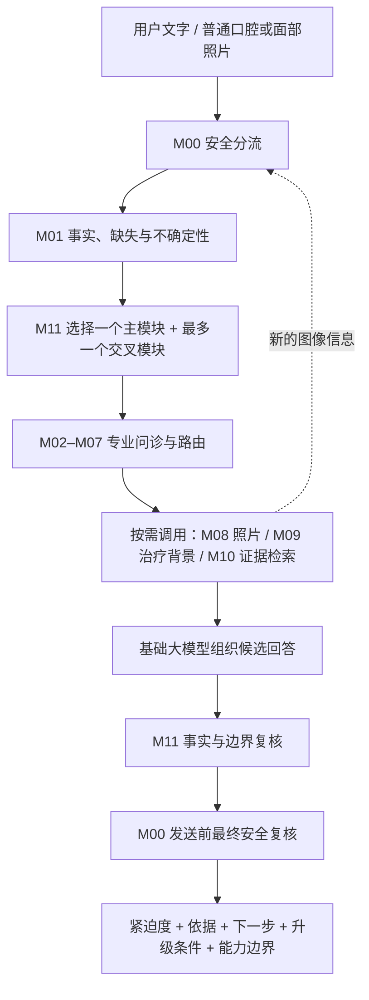

# 🦷 牙医搭子 `yayi-dazi`

> 懂口腔，也懂你的 AI 搭子。

牙疼的时候，最怕看到两种回答：

- “问题不大，再观察一下。”
- “建议尽快就医。”

一个可能低估风险，一个听起来正确，却还是没说清“有多快、去哪里、为什么”。

而且，口腔问题不只有牙疼。牙龈出血、口腔溃疡、假牙松动、牙列不齐、中线偏移、笑线和面部不对称，都可能是用户真正在意的事。

所以我做了「牙医搭子」。

它不急着在屏幕里给你下诊断，而是先把混乱的描述整理成一份更安全、更清楚、更能行动的就医参考。

## ✨ 它到底能做什么？

| 你遇到的问题 | 牙医搭子会做的事 |
|---|---|
| 不知道现在急不急 | 先完成安全分流，给出紧迫度、时间窗口和升级条件 |
| 症状很多，不知道怎么说 | 只追问会影响风险、去向和专业路由的关键信息 |
| 不知道挂哪个科 | 在牙体牙髓、牙周、黏膜、修复、正畸美观、颌面及跨专科方向中选择主路由 |
| 想问正畸、笑容或面部不对称 | 保留美观目标，同时先排查会影响健康与就医时效的问题 |
| 上传了口腔或面部照片 | 评估照片质量，记录中性的可见信息，并明确哪些事不能从普通照片得出 |
| 想了解可能的处理方向 | 仅提供非个体化的治疗类别背景与可追溯文献方向 |

## 🧠 一次咨询是怎么跑完的？



这套流程里，我最在意的不是“模型猜对了什么病”，而是下面五个产品原则：

1. **每次新信息都要重新回到 M00。** 风险不能被后续模块平均掉。
2. **`unknown` 不等于 `no`。** 用户没说，就不能替用户否认。
3. **健康与美观可以同时存在。** 健康问题优先处理，美观目标不会被丢掉。
4. **照片只能升级、澄清或返回不可评估。** 它不能降低已确认的风险。
5. **RAG 是参考上下文，不是用户的诊断证据。** 检索到某个病名，不代表用户就得了这个病。

## 📚 不是“凭感觉写规则”

项目以 7 本中国医学与口腔规划教材建立专业骨架：

- 《诊断学》第 10 版
- 《口腔科学》第 10 版
- 《牙体牙髓病学》第 5 版
- 《牙周病学》第 5 版
- 《口腔黏膜病学》第 5 版
- 《口腔修复学》第 8 版
- 《口腔正畸学》第 7 版

教材原文不随仓库上传；运行时使用的是已整理的结构化知识、来源定位和边界规则。安全部分会结合公开专业指南进行内部交叉验证，用户端则始终按中国本地就医环境表达。

| 已沉淀资产 | 数量 |
|---|---:|
| 口腔黏膜结构化条目 | 142 |
| 普通照片规则 | 93 |
| 治疗类别参考 | 90 |
| 统一知识条目 | 495 |
| 可追溯来源定位记录 | 427 |

## 📊 评测结果：有提升，也有没证明的部分

我用 22 个全新规则对照案例，分别跑了三组独立任务：

- A：基础大模型
- B：基础大模型 + Skill
- C：基础大模型 + Skill + 盲检索正文

共生成并评分 66 份输出。

| 作品集级离线指标 | A 基础模型 | B + Skill | C + Skill + RAG |
|---|---:|---:|---:|
| 安全等级完全命中 | 20/22 | 22/22 | 22/22 |
| 11 组成对安全边界完全命中 | 9/11 | 11/11 | 11/11 |

这组结果支持的是：**在本批规则推导案例中，Skill 提升了安全边界的工程一致性。**

但我也保留了一个不那么“好看”、却更重要的结果：**C 组和 B 组持平，这批测试没有观察到 RAG 的额外可测增益。** 这说明当前案例主要在测规则和路由，下一轮需要单独设计证据问答、引用核验和长尾知识案例。

> 请注意：这些标签由规则推导，尚未完成口腔专业人员双人独立审核与裁决。上述结果是作品集级离线工程验证，不是医学准确率，也不代表临床有效性。

## 🛡️ 它不是什么？

牙医搭子是一个面向中国成年用户的口腔咨询辅助 Skill，不是线上牙医。

它不会：

- 根据文字或照片确诊疾病；
- 推荐处方药、抗生素、个体剂量或疗程；
- 提供器械、手术、根管、正畸加力或居家操作步骤；
- 替用户选择拔牙、根管、种植、正畸、正颌或其他个人治疗方案；
- 独立解读 X 线片、CBCT、CT、MRI 或病理切片；
- 取代具备资质的口腔专业人员面诊。

当前状态：`ENGINEERING_READY_NOT_RELEASE_VALIDATED`。个人本地安装已完成并验证，但 `production_enabled=false`，不得用于临床生产或宣称临床有效。

## 🚀 怎么使用？

将仓库安装到个人 Codex Skills 目录后，在新任务中显式调用：

```text
$yayi-dazi 我最近右下后牙反复疼，昨天开始有点脸肿。
```

也可以询问：

```text
$yayi-dazi 我刷牙总出血，需要先看哪个科？

$yayi-dazi 我在意牙齿中线和面部不对称，面诊前需要整理哪些信息？

$yayi-dazi 这张口内照片的拍摄质量足够用来补充咨询吗？
```

> 安装不代表默认授权医疗建议。本 Skill 只支持显式调用。

## 🛠️ 项目结构

```text
.
├── SKILL.md                    # Skill 的核心说明与行为约束
├── agents/openai.yaml          # 显示名称、默认提示与显式调用策略
├── references/                 # 分流、状态机、专业边界、结构化知识与发布状态
└── scripts/                    # 可移动的 M00–M12 运行时与自检
```

运行时不需要第三方 Python 依赖。当前完整 M00–M12 自检为 `13/13 passed`，最终包审计为 `18/18 passed`。这些只代表工程完整性，不代表医学有效性。

## 🎯 下一步

- 由两名具备资质的口腔专业人员独立审核参考标签，并对分歧进行裁决；
- 补充合法授权的真实图像，完成双人标注、评分校准和小规模验证；
- 单独设计能测出 RAG 价值的证据问答、引用核验和知识时效案例；
- 完成发布级专业盲审后，再讨论临床生产与发布决策。

---

我想做的不是一个“什么都敢回答的 AI 牙医”。

而是一个知道什么时候应该停下来、什么信息还不够、什么问题必须交回给专业人员的 AI 搭子。

`#AI产品经理` `#医疗AI` `#Agent` `#RAG` `#口腔健康` `#正畸美观` `#作品集`
