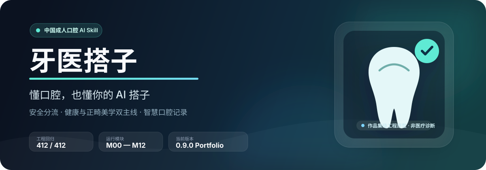
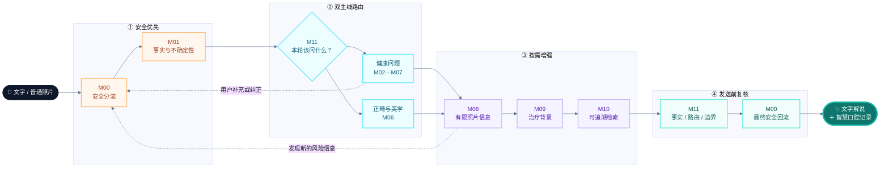

<p align="center">
  
</p>

<p align="center">
  
  
  
  
</p>

<p align="center"><strong>把“我牙有点不舒服”变成一份真正便于行动和面诊沟通的口腔记录。</strong></p>

<p align="center">
  <a href="#30-秒看懂牙医搭子">30 秒看懂</a> ·
  <a href="#一次咨询如何运行">运行流程</a> ·
  <a href="#智慧口腔记录长什么样">输出示例</a> ·
  <a href="#工程与评测">工程评测</a> ·
  <a href="#安装与使用">安装使用</a>
</p>

---

## 30 秒看懂牙医搭子

牙医搭子 `yayi-dazi` 是一款面向中国成年用户的口腔健康与成人正畸美学智能预评估 Skill。

用户只需描述症状、困扰或美观诉求。它会先识别需要优先处理的安全信号，再用尽量少的追问补齐关键信息，同时保留健康与美观两条线索，最终形成一份精简的**智慧口腔记录**。

> [!IMPORTANT]
> 它提供口腔问题方向预评估、紧迫度提示、专业科室路由和面诊准备，不根据文字或普通照片确诊疾病，也不替代具备资质的口腔专业人员。

| 你可能正在经历 | 牙医搭子帮你厘清 |
|---|---|
| “现在需要马上去医院吗？” | 紧迫度、建议时间范围与升级条件 |
| “这大概该看哪个方向？” | 牙体牙髓、牙周、黏膜、修复、正畸或颌面等专业路由 |
| “牙不齐、嘴凸、脸不对称该怎么描述？” | 正畸美学关注点、健康优先项与面诊资料准备 |
| “我说了很多，医生能快速看懂吗？” | 精简、可更新、只保留有效信息的智慧口腔记录 |

### 为什么不是又一个“建议尽快就医”的聊天机器人？

- **先分流，再解释。** 每次新增信息都会回到安全层复核，关键风险不会被后续闲聊冲淡。
- **健康与美观不二选一。** 疼痛、牙周与黏膜风险优先处理，中线、笑容、咬合和面部不对称诉求继续保留。
- **追问有预算。** 默认每轮只问一个会影响行动的问题，普通流程通常不超过两轮必要澄清。
- **输出可直接带去面诊。** 不是堆满空字段的电子病历，而是一份围绕“现在怎么办”的动态记录。

## 一次咨询如何运行



这张图里最重要的不是模块数量，而是三条产品原则：

1. **任何新增信息都能回到 M00。** 后续模块无权降低已识别的安全下限。
2. **`unknown` 不等于 `no`。** 用户没有说明的情况会作为待确认项保留，而不是被模型擅自否认。
3. **检索只提供参考上下文。** 检索相似度不是医学置信度，命中条目也不是当前用户的诊断证据。

<details>
<summary><strong>展开查看 M00—M12 模块地图</strong></summary>

| 模块 | 负责什么 | 用户侧价值 |
|---|---|---|
| M00 | 安全分流与最终回流 | 先判断是否存在需要优先处理的信号 |
| M01 | 事实、否定事实与未知项 | 防止把“没说”误写成“没有” |
| M02—M05 | 牙体牙髓、牙周、黏膜、修复等方向 | 选择真正影响路由和行动的问题 |
| M06 | 成人正畸、咬合与颌面美学 | 同时处理健康优先项与美观诉求 |
| M07 | 颌面、关节、外伤、肿胀等跨专业问题 | 处理容易漏分流或错科的复杂场景 |
| M08 | 普通照片质量与有限可见信息 | 只补充可见事实，不制造“AI看诊”错觉 |
| M09 | 非个体化治疗类别背景 | 帮用户理解线下面诊可能讨论什么 |
| M10 | 模块隔离的证据检索 | 提供可追溯知识，不越权给诊断 |
| M11 | 主 Agent 编排与输出复核 | 控制追问、路由、事实和表达边界 |
| M12 | 评测与发布门禁 | 区分工程通过和医学有效性 |

</details>

## 智慧口腔记录长什么样

它不会一股脑展示所有字段。普通咨询默认只选择四个核心栏目，最多增加两个与本轮直接相关的条件栏目；空栏目不显示。

> ### 智慧口腔记录
>
> **主要问题**  
> 右下后牙反复疼痛，近一天出现面部肿胀。
>
> **关键信息**  
> 疼痛反复出现；目前伴有面部肿胀；张口和吞咽情况尚未确认。
>
> **初步评估**  
> 面部肿胀提示需要优先排查感染扩展风险，目前不能仅凭文字确认具体病因。
>
> **下一步**  
> 建议今天咨询口腔急诊或口腔颌面外科。若出现呼吸、吞咽困难或肿胀快速扩大，应立即前往综合医院急诊科。
>
> *本记录由人工智能生成，仅用于信息整理和就诊准备，不构成医疗诊断或个人治疗方案。*

### 同一内容，适配不同屏幕

| 移动端 / 纯文字 | 电脑端 |
|---|---|
| 单列短段落，行动信息前置；不使用宽表格 | 顶部行动摘要，左侧主要记录，右侧下一步行动区 |
| 一屏先看懂“现在怎么办” | 关键信息达到两项后可使用精简两列表格 |

布局只负责重排同一组审核后信息，不会因为换了设备生成另一套医学结论。

## 覆盖范围

| 健康问题 | 正畸与美学 | 复杂与跨专业问题 |
|---|---|---|
| 牙痛、敏感、牙体缺损、治疗后不适 | 牙列、咬合、牙齿中线、笑容 | 颞下颌关节、颌面肿胀、外伤 |
| 牙龈出血、退缩、松动 | 成人正畸目标与面诊准备 | 唾液腺、包块、疼痛或感觉变化 |
| 口腔溃疡与其他黏膜异常 | 嘴凸、侧貌与面部不对称困扰 | 缺牙、修复体、义齿与种植修复咨询 |

普通照片仅用于质量判断和有限可见事实补充。项目当前真实图像集为 0、专业图像标注为 0，因此不会根据照片作毫米测量、错𬌗分级、牙性/骨性判断或疾病排除。

## 专业与知识基础

项目以 7 本中国医学与口腔规划教材建立知识框架，并结合公开专业指南、标准与中国数据治理依据维护安全边界：

- 《诊断学》第 10 版；
- 《口腔科学》第 10 版；
- 《牙体牙髓病学》第 5 版；
- 《牙周病学》第 5 版；
- 《口腔黏膜病学》第 5 版；
- 《口腔修复学》第 8 版；
- 《口腔正畸学》第 7 版。

仓库不包含教材原文、扫描件或教材图片。当前登记 41 项来源和 1 个统一知识快照；安全与公开指南按 90 天复核，统一知识目录按 180 天复核，教材版次按 365 天检查。审计不会联网或自动改写医学规则。

详细权利范围见 [NOTICE.md](NOTICE.md)，数据边界见 [PRIVACY.md](PRIVACY.md)。

## 工程与评测

### 当前资产

| 工程资产 | 数量 / 状态 |
|---|---:|
| 口腔黏膜结构化条目 | 142 |
| 普通照片规则 | 93 |
| 治疗类别参考 | 90 |
| 统一知识条目 | 495 |
| 作品集 V3 文字案例 | 144 |
| 最小变化对照 | 36 组 |
| RAG 专项查询 | 36 |
| 自动回归测试 | 412 / 412 通过 |
| M00—M12 运行自检 | 15 / 15 通过 |
| 交付预检 | 24 / 24 通过 |
| 最终包审计 | 19 / 19 通过 |

这些数字说明的是**工程完整性、规则一致性和可追溯性**，不是医学准确率或临床有效性。

### RAG 工程诊断

| 检索方案 | Hit@3 | 错模块结果率 |
|---|---:|---:|
| 全库 BM25 | 86.11% | 39.81% |
| 模块与知识类型过滤后 BM25 | 91.67% | 0% |
| 过滤后简化文本 BM25 | 88.89% | 0% |
| 合同强化后的实际 M10 链路 | 91.67% | 0% |

当前最明确的 RAG 收益来自**路由过滤**，而不是单纯缩短文档。实际链路将 36 例拆成 37 次模块隔离请求，37/37 次执行路由限制，未授权模块结果数为 0。

<details>
<summary><strong>评测为什么不能写成“医学准确率”</strong></summary>

作品集 V3 数据集包含 144 例虚构文字案例，其中开发集 48 例、锁定测试集 72 例、挑战集 24 例；36 组最小变化对照共 72 例。数据集已完成结构审计，但未经过口腔专业人员双盲审核，也没有真实患者结果。

历史 22 例三组对照显示，Skill 在自有规则案例中提升了安全和边界一致性；RAG 相对纯 Skill 没有检测到增益。由于标签由项目规则推导、样本量有限且没有专业独立审核，这些结果存在循环论证风险，只能作为工程迭代证据。

完整披露见 [评测数据集说明](evaluation/DATASET_CARD.md) 和 [RAG 消融结果](evaluation/rag-ablation-results.json)。

</details>

## 能力边界

牙医搭子不会：

- 根据文字或普通照片确诊、排除具体疾病，或输出个人患病概率；
- 推荐处方药、抗生素、个体剂量、频次或疗程；
- 替用户选择拔牙、根管、种植、正畸、正颌等个人治疗方案；
- 提供器械、手术、正畸加力或自行操作步骤；
- 独立解读 X 线片、CBCT、CT、MRI 或病理切片；
- 把检索命中、照片质量分数或模型置信分数包装成医学结论；
- 取代具备资质的口腔专业人员面诊。

> [!CAUTION]
> 照片分析、治疗背景、知识检索和模型评测仍属于 `experimental_not_validated`。公开演示只应使用虚构案例；公众或机构真实数据处理当前保持关闭。

## 安装与使用

仓库中的可安装目录是 `skills/yayi-dazi/`。在 Codex 中可让 Skill Installer 从以下地址安装：

```text
请安装 https://github.com/ianisgoingtobebigone/yayi-dazi/tree/main/skills/yayi-dazi
```

安装后新建任务，并显式调用：

```text
$yayi-dazi 我最近右下后牙反复疼，昨天开始有点脸肿。
```

正畸美学场景示例：

```text
$yayi-dazi 我在意牙齿中线、笑容和面部不对称，想先整理面诊需要说明的信息。
```

本 Skill 仅支持显式调用。个人安装不代表允许临床生产使用。

## 仓库结构

```text
.
├── README.md               # 项目与产品说明
├── PRIVACY.md              # 数据与隐私边界
├── NOTICE.md               # 来源和权利说明
├── evaluation/             # 数据集、协议与工程评测结果
└── skills/yayi-dazi/
    ├── SKILL.md            # Agent 核心工作流
    ├── agents/             # Skill 界面元数据
    ├── references/         # 按需加载的规则与知识契约
    └── scripts/            # M00—M12 运行和本地审计
```

项目介绍与 Skill 运行内容分层保存，README 不会进入 Agent 的运行上下文。

## 当前状态与路线图

| 项目 | 当前状态 |
|---|---|
| 作品集版本 | `0.9.0-portfolio` |
| 公开产品状态 | `PORTFOLIO_ENGINEERING_PROTOTYPE` |
| 个人本地使用 | 允许，显式调用 |
| 公众真实数据服务 | 未启用 |
| 临床生产 | `production_enabled=false` |
| 临床有效性声明 | `clinical_validity_claim_allowed=false` |

接下来最值得做的四件事：

- 用虚构案例完成小规模普通用户任务测试；
- 寻找可负担的口腔专业抽样审核方式；
- 建立来源合法、授权明确的真实图像小样本；
- 在严格模块路由之后评估语义重排是否带来真实增益。

---

## 如果这个项目对你有启发

如果你也在关注医疗 AI、Agent、RAG、正畸美学或安全型产品设计：

- ⭐ **Star**：关注后续专业审核与真实用户验证；
- 💬 **Issue**：提交你希望覆盖的虚构使用场景或边界问题；
- 🔎 **Review**：从产品、工程、口腔专业或合规视角指出可以被证伪的问题。

这个项目不靠“AI 替代牙医”证明价值。它想验证的是：**AI 能否在不越过专业边界的前提下，把零散的口腔困扰整理成更安全、更清楚、更便于行动的信息。**

<p align="center"><strong>牙医搭子 · 懂口腔，也懂你的 AI 搭子</strong></p>
