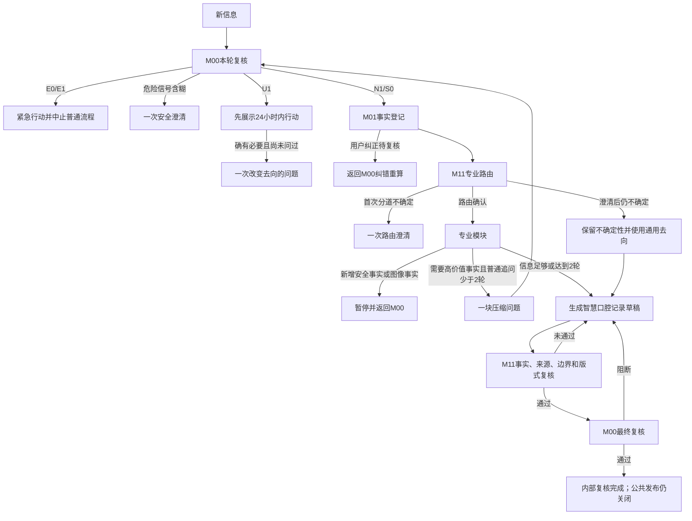

# 主Agent总体状态机

状态：节点4候选版。M00医学分级依据未改变；本次把M00安全状态、M11跨轮状态和用户输出形态统一接入。生产继续禁用。

## 目录

1. 状态职责
2. 跨轮变量
3. 统一状态
4. 判定优先级
5. 状态转移
6. 强制约束
7. 回流和纠正
8. 完成条件

## 1. 状态职责

- M00只决定安全等级、时效、去向、风险下限和安全澄清，不决定专业模块或版式。
- M11保存跨轮状态，决定专业路由、是否等待用户或M00、能否调用模块、何时生成记录及何时进入最终复核。
- 基础模型只在状态允许时提出问题或组织候选回答，不能自行改变状态。
- 渲染端只重排审核后的栏目，不能改变事实、等级、路由或下一步。

M00原有`next_state`继续作为安全子状态保留；M11返回的`state_machine.current_state`是主Agent应执行的统一状态。两者不能互相覆盖。

## 2. 跨轮变量

- `candidate_level`：只看本轮新信息得到的候选等级。
- `risk_floor_level`：同一问题中已经确认的最高紧迫度。
- `effective_level`：本轮实际执行等级，取候选等级和风险下限中更紧急者。
- `clarification_used`：安全危险信号的一次澄清是否已使用。
- `route_clarification_used`：一次专业分道澄清是否已经真正发出；进入澄清状态本身不消耗机会。
- `question_history`：已发出问题编号、目的和目标事实，用于阻止重复追问。
- `ordinary_question_rounds`：普通压缩问题块轮数，上限为2。
- `correction_recheck_pending`：用户纠正是否仍在等待M00纠错重算。
- `current_flow_state`及`flow_state_history`：当前统一状态及逐轮转移记录。

等级顺序固定为`E0 > E1 > U1 > N1 > S0`；`NEEDS_CLARIFICATION`是安全过渡结果，不参加高低排序。

## 3. 统一状态

| 统一状态 | 系统动作 | 等待对象 | 用户输出 |
|---|---|---|---|
| `START` | 等待第一条相关信息 | 用户 | 无 |
| `E0_ACTION_HALT` | 立即展示医疗急诊行动并停止普通流程 | 无 | 紧急行动 |
| `E1_ACTION_ROUTE` | 立即展示紧急牙科去向并停止普通流程 | 无 | 紧急行动 |
| `SAFETY_CLARIFICATION_WAIT` | 只问M00批准的一个安全问题 | 用户 | 安全澄清 |
| `U1_ACTION_READY` | 立即展示当天或24小时内行动 | 无 | 紧迫简版 |
| `U1_DESTINATION_ANSWER_WAIT` | 先展示U1行动，再问一个改变去向的问题 | 用户 | 紧迫简版 |
| `M00_CORRECTION_RECHECK_WAIT` | 暂停模块和生成，提交用户纠正 | M00 | 简短等待说明 |
| `ROUTE_CLARIFICATION_WAIT` | 问一个改变专业分道的问题 | 用户 | 路由澄清 |
| `M00_IMAGE_RECHECK_WAIT` | 暂停后续模块，提交新增图像候选事实 | M00 | 简短等待说明 |
| `M00_STRUCTURED_FACT_RECHECK_WAIT` | 暂停后续模块，提交专业模块新增安全事实 | M00 | 简短等待说明 |
| `COMPACT_INTAKE_ANSWER_WAIT` | 提出一块不超过3点的紧密相关问题 | 用户 | 压缩问题块 |
| `SMART_RECORD_DRAFT_READY` | 允许基础模型组织智慧口腔记录 | 基础模型 | 尚未发送 |
| `SAFE_FALLBACK_DRAFT_READY` | 模块失败，按已有事实生成不降级的精简记录 | 基础模型 | 尚未发送 |
| `DRAFT_REGENERATION_WAIT` | M11拦截草稿并要求修订 | 基础模型 | 无 |
| `FINAL_GUARD_WAIT` | M11已通过，等待M00发送前复核 | M00 | 无 |
| `M00_FINAL_GUARD_BLOCKED` | M00阻断候选回答，返回重新生成 | 基础模型 | 无 |
| `INTERNAL_REVIEW_COMPLETE` | 内部复核完成，仍受生产发布门禁限制 | 无 | 公共发布关闭 |

## 4. 判定优先级

统一状态按以下顺序决定，前一项一旦命中，后一项不得覆盖：

1. E0、E1紧急行动；
2. M00安全澄清；
3. U1立即行动及至多一次改变去向的问题；
4. 用户纠正、图像事实或专业安全事实返回M00；
5. 专业路由澄清；
6. 普通压缩问询；
7. 草稿复核与M00最终复核；
8. 模块失败安全回退；
9. 智慧口腔记录生成。

模块失败只能降低功能完整性，不能越过前面的安全状态，也不能默认S0。

## 5. 状态转移

任何等待用户的状态收到新信息后，都先返回M00本轮复核，而不是直接延续旧问题路径。

## 6. 强制约束

1. `risk_floor_level`在同一问题中单调不下降；普通流程不存在E0、E1或U1向更低等级的转移。
2. E0、E1不允许调用M02至M10、索要照片、继续美观问询或生成完整记录。
3. U1行动必须先展示；改变去向的问题全程最多一个，不能换一个目标继续问。
4. 普通问询每轮最多一块、每块最多3个紧密相关信息点；全程最多两轮。
5. 已问问题或已提供事实不得重复询问。
6. 路由澄清只有问题真正发出后才记为已使用；仍不确定时不再追问，也不虚构确定模块。
7. 智慧口腔记录只有在安全回流、纠正回流和必要澄清均已完成后才能生成。
8. 最终发送前必须经过M11草稿复核和M00最终复核。

## 7. 回流和纠正

- 用户每次补充文字、纠正或照片，都先运行本轮M00。
- M08或M02至M07产生新的安全候选事实时，本轮不得同时追问、生成草稿或进入最终复核。
- 用户纠正必须同时保存原事实和纠正事实，并将`correction_recheck_pending`设为真。
- M00完成有记录的纠错重算后，调用方显式提交`correction_recalculation_confirmed=true`，才能恢复路由和记录流程。
- 照片不可降低风险下限；不可见或看不清不等于危险表现不存在。

## 8. 完成条件

`INTERNAL_REVIEW_COMPLETE`只表示当前候选回答已经通过M11和M00内部门禁，不表示临床有效、专业验证通过或可以公开生产发布。当前`production_enabled=false`，因此运行包仍不直接产生公共`user_output`。
